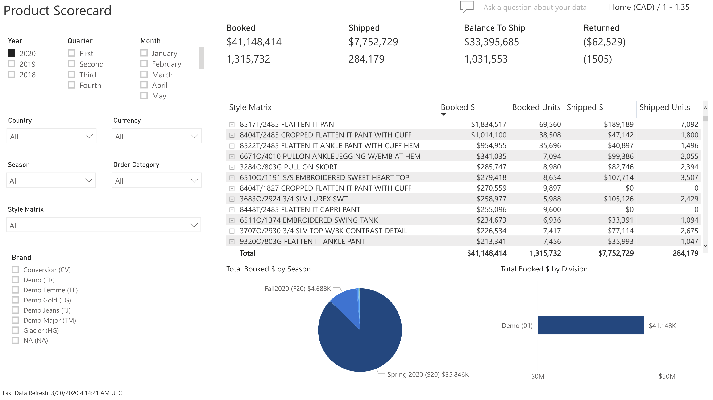
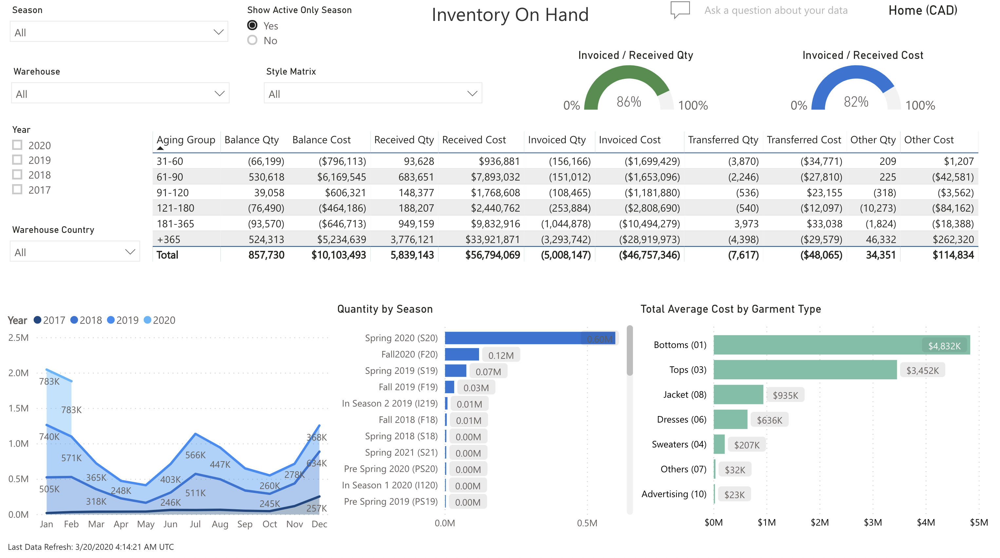

<!-- markdownlint-disable MD041 -->

## Overview

**trenza.bi** is a complete set of robust, ERP dashboards that present information in easy-to-digest nuggets to monitor your information anywhere and anytime. The information presented covers all of the important parts of your business from high-level Executive dashboards to lower-level Sales, Inventory, and Product scorecards. Microsoft Power BI delivers the stunning front-end visuals to bring all of your relevant information to the surface allowing you to make better decisions and become more agile to changing market conditions. And, one of the most powerful features of **trenza.bi** is the natural language query that allows you to ask questions about the data and get instant results.

**trenza.bi** includes the following dashboards and features.  

### [Executive](pages/executive.md)

Provides a holistic view of the business.

### Sales

#### [Sales Scorecard](pages/sales-scorecard.md)

Analyze sales and sales forecast data across periods with extended drill downs.

#### Sales Analysis

Analyze sales this year compared to last year with extended drill downs.

#### Product Scorecard

Analyze product sales data across periods with extended drill downs.

### Inventory

#### Inventory Management

Analyze Inventory position using different inventory calculations and filter by Division, Brand, Garment Type, Season, Warehouse.

#### Inventory On Hand

Analyze the aging of the on hand inventory using several filters.

#### Inventory Left To Sell

Analyze the left to sell inventory using several filters.

### Accounts Receivable

Analyze the aging of accounts receivable by customer type.

### Shipping Projection

Analyze how actual shipping is trending against forecasted shipping for a given time.

### Q&A

Allows users the ability to enter queries in intuitive natural language and render the information in graphs and charts.

