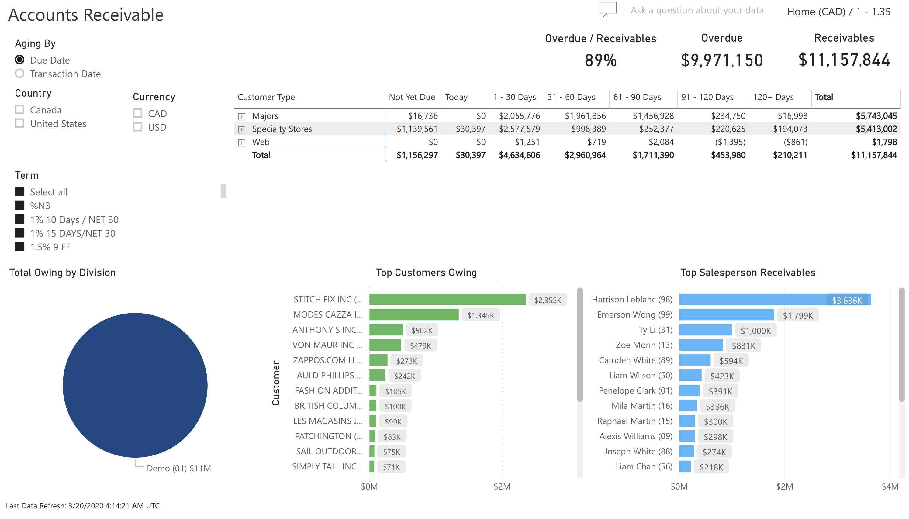

<!-- markdownlint-disable MD033 -->

# Accounts Receivable

Allows users the ability to analyze the aging of accounts receivable by customer type.

## Slicers

* Aging By (Single Selection)
  * Will provide aging based on the Due Date or Transaction Date
* Country (Multiple Selection)
  * Will filter the data to only show transactions for the selected country
* Currency (Multiple Selection)
  * If selected, will filter the data to show only the transactions for that currency
* Term (Multiple Selection)
  * Will filter the data to only show transactions under the selected terms

## Totals

* Overdue / Receivables
* Overdue = Receivable - (Not Yet Due + Today)
* Receivables = Total of Balance Owing on AR Open Items

## Currency

Indicates whether the data shown is in Home or Local Currency, along with the exchange rate stored in the system.

## Aging by Customer Type Grid

* Customer Type
* Not Yet Due = The Due date for the balance is negative 
* 0 – 30 Days = Balance Owing from AR Open Items based on Due Date * Exchange Rate
* 31 – 60 Days = Balance Owing from AR Open Items based on Due Date * Exchange Rate
* 61 – 90 Days = Balance Owing from AR Open Items based on Due Date * Exchange Rate
* 91 – 120 Days = Balance Owing from AR Open Items based on Due Date * Exchange Rate
* 120+ Days = Balance Owing from AR Open Items based on Due Date * Exchange Rate
* Total = Sum of all Owing by Customer Type

## Total Owing by Division

Allows the user the ability to hover to view the Total Owing for that Division, or the user can click on the Division to focus all information on the dashboard

## Top Customers Owing

Displays the customers that are owing the most. Users can hover over a bar to show the amount owing or click on a bar to focus the visuals to that customer.

## Top Salesperson Receivables

Displays the salespeople that brought in the most receivables. Users can hover over a bar to show the amount owing or click on a bar to focus the visuals to that salesperson.

