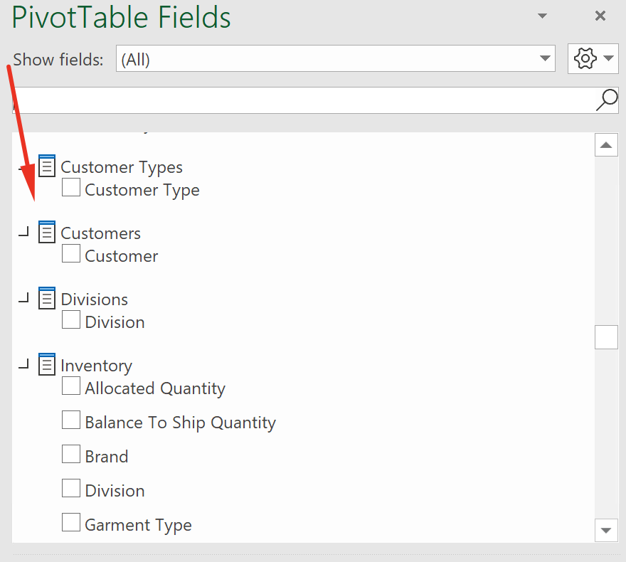

<!-- markdownlint-disable MD033 -->

# Using Excel to Connect to Analytics Models

If you do not already have an existing Excel spreadsheet connected to the analytics models, open a Power BI dashboard and click "Analyze in Excel",

If the following message appears, it is simply informing you that for security reasons, you will need to sign in from within Excel when connecting to the analytics models. Click "Open in Excel".

You might also be presented with this message to make sure that you have the latest Excel updates to be able to connect to analytics models. You can click on "Learn more about this update" for details but in summary, if you have Microsoft Excel 2010 SP1 and later, you shouldn't have to update or install anything else.

Click "I've already installed these updates",

Your browser will download an "odc" file.

The ODC file extension is an Office Data Connection File which was developed by Microsoft. The file format is a connection information file that contains properties to connect to and retrieve data from an external data source.

Open Excel, create a new blank workbook, click "Data", and click "Existing Connections",

"Browse for More..." and then select the "odc" file.

For security reasons, you will need to log in with your Office 365 account. Only authenticated users with assigned security access will be able to connect to the corporate data.

Sign in with your Office 365 credentials.

These are [measures](https://docs.microsoft.com/en-us/analysis-services/tabular-models/measures-ssas-tabular):

These are [dimensions](https://docs.microsoft.com/en-us/analysis-services/multidimensional-models-olap-logical-dimension-objects/dimensions-introduction):

You can save the spreadsheet. When you reopen it at a later date, you will need click "Enable Content". 

