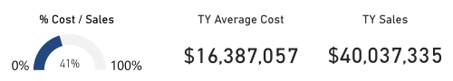
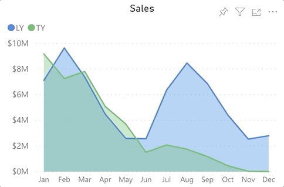
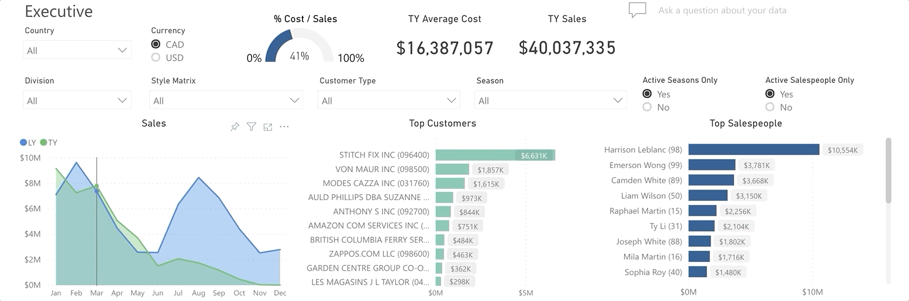
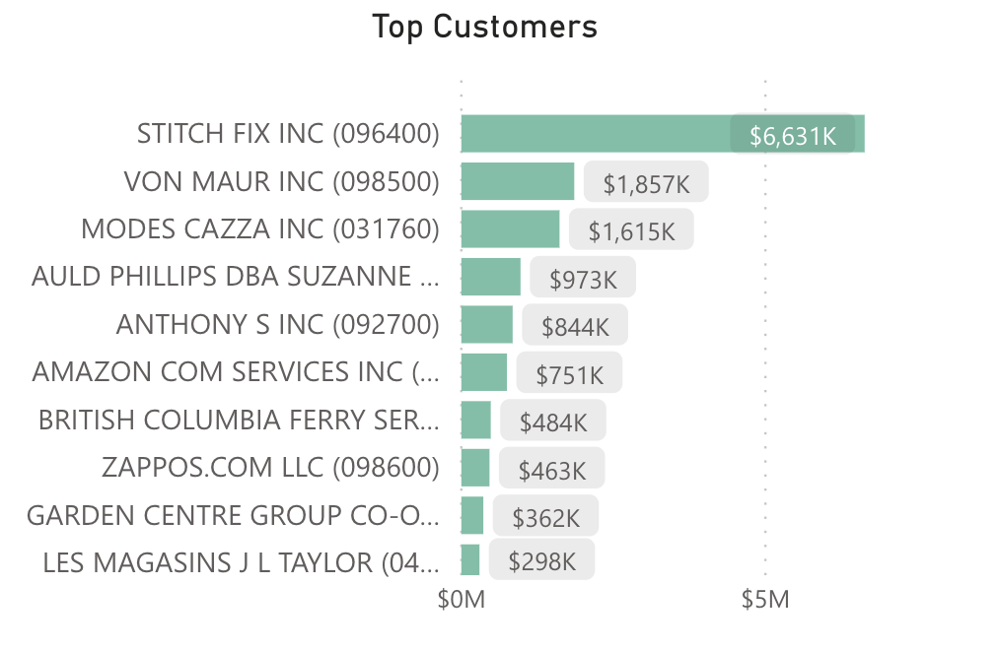
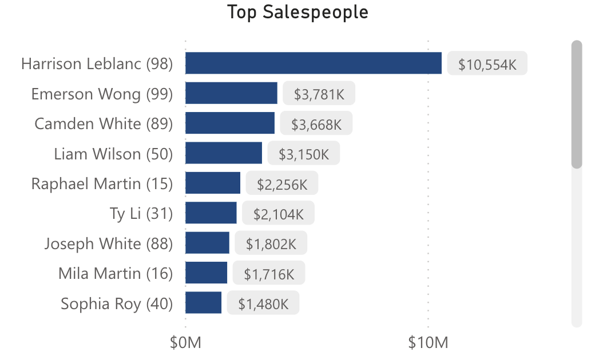
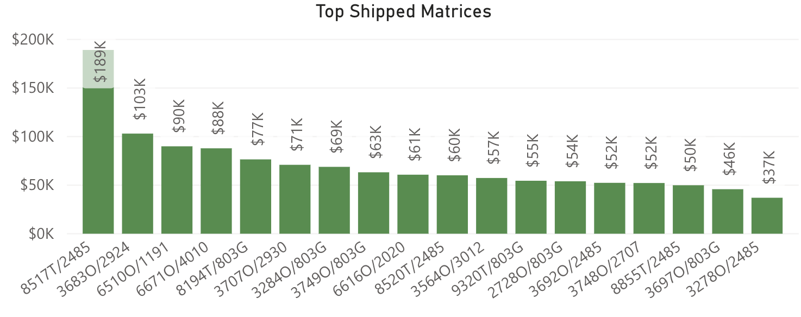
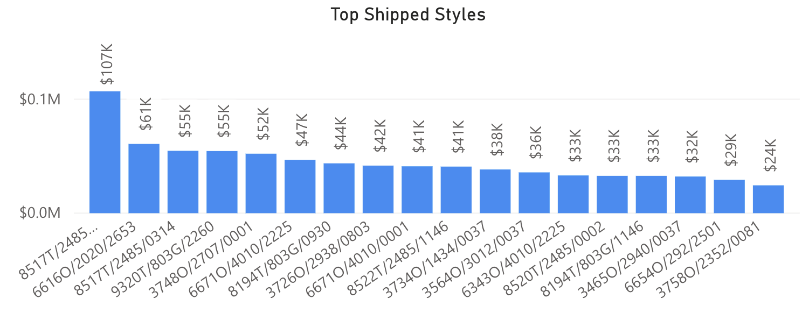

<!-- markdownlint-disable MD033 -->

# Executive

The Executive dashboard provides a wholistic view of the business.

## Videos

Booked by Country

Booked by Style

The Executive dashboard can be broken down into the following sections:

## Slicers

* Country (Multiple Selection)
  * Will filter the data to only show transactions for the selected countries
* Currency (Single Selection)
  * This dashboard can be displayed in either CAD or converted to USD based on the exchange rate at the time of the transaction.
* Division (Multiple Selection)
  * Will filter the data to only show transactions for the selected divisions
* Style Matrix (Multiple Selection)
  * Will filter the data to only show transactions for the selected styles
* Customer Type (Multiple Selection)
  * Will filter the data to only show transactions for the selected Customer Types
* Season (Multiple Selection)
  * Will filter the data to only show the data related to the seasons selected
* Active Seasons Only (Single Selection)
  * Will filter the data to only show active seasons (from ERP / Fashion Web App)
* Active Salespeople Only (Single Selection)
  * Will filter the data to only show active salespeople (from ERP / Fashion Web App)

## Totals

"TY" stands for this year - current calendar year starting January.

* % Cost / Sales = (TY Average Cost / TY Sales) * 100
* TY Average Cost = sum of the average weighted style cost
* TY Sales = sum of the sales

## Sales

Allows user to compare last year's sales with this year's sales by month by hovering over a specific point on the chart,

 or clicking on a point on the chart to focus the dashboard to that month,

## Top Customers

Displays the customers that have the highest booked amount. Users can hover over a bar to show the booked amount or click on a bar to focus the visuals to that customer.

* Booked: Shipped Dollars + Balance to Ship Dollars

## Top Salespeople

Displays the salespeople that have made the most sales. Users can hover over a bar to show the booked amount or click on a bar to focus the visuals to that salesperson.

* Booked: Shipped Dollars + Balance to Ship Dollars

## Top Shipped Matrices

Displays the style matrices that have been shipped the most. Users can hover over a bar to show the shipped amount, shipped quantity, booked amount, booked quantity, returned amount, and returned quantity, or click on a bar to focus the visuals to that style.

* Booked
  * Dollars = Shipped Dollars + Balance to Ship Dollars
  * Units = Shipped Units + Balance to Ship Units
* Shipped
  * Dollars = Sum of Shipped Dollars on Invoices where AR Type Code = 01 (Invoices)
  * Units = Sum of Shipped Units on Invoices where AR Type Code = 01 (Invoices)
* Returned
  * Dollars = Sum of all Invoice Dollars where AR Type = 02 (Credit Note)
  * Units = Sum of all Invoice Units where AR Type = 02 (Credit Note)

> **Note**: GLs are not included in the Return calculation

## Top Shipped Styles

Displays the style/colors that have been shipped the most. Users can hover over a bar to show the shipped amount, shipped quantity, booked amount, booked quantity, returned amount, and returned quantity, or click on a bar to focus the visuals to that style.

* Booked
  * Dollars = Shipped Dollars + Balance to Ship Dollars
  * Units = Shipped Units + Balance to Ship Units
* Shipped
  * Dollars = Sum of Shipped Dollars on Invoices where AR Type Code = 01 (Invoices)
  * Units = Sum of Shipped Units on Invoices where AR Type Code = 01 (Invoices)
* Returned 
  * Dollars = Sum of all Invoice Dollars where AR Type = 02 (Credit Note)
  * Units = Sum of all Invoice Units where AR Type = 02 (Credit Note)

> **Notes**:
>
> * All dollar amounts are net, not gross.
> * GLs are not included in the Return calculation.