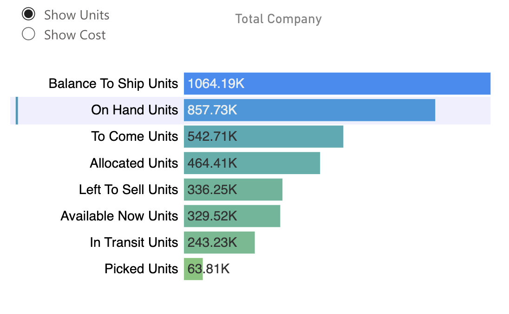
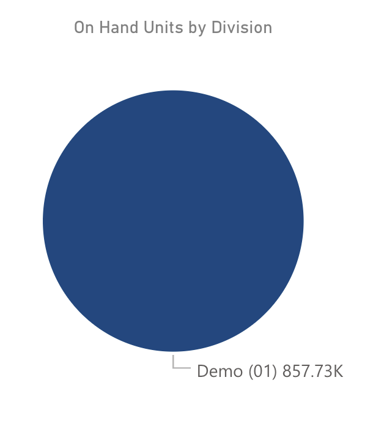
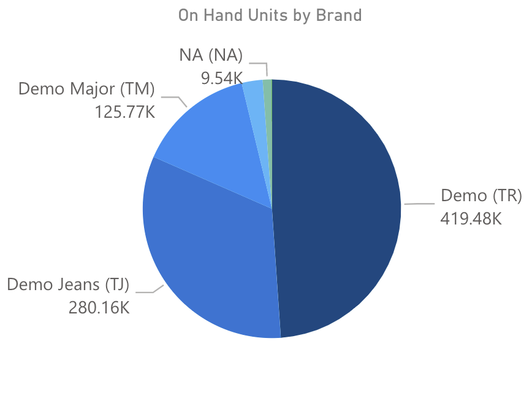
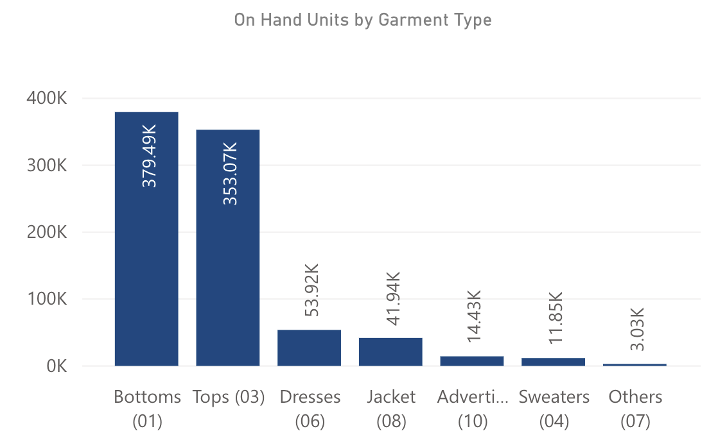
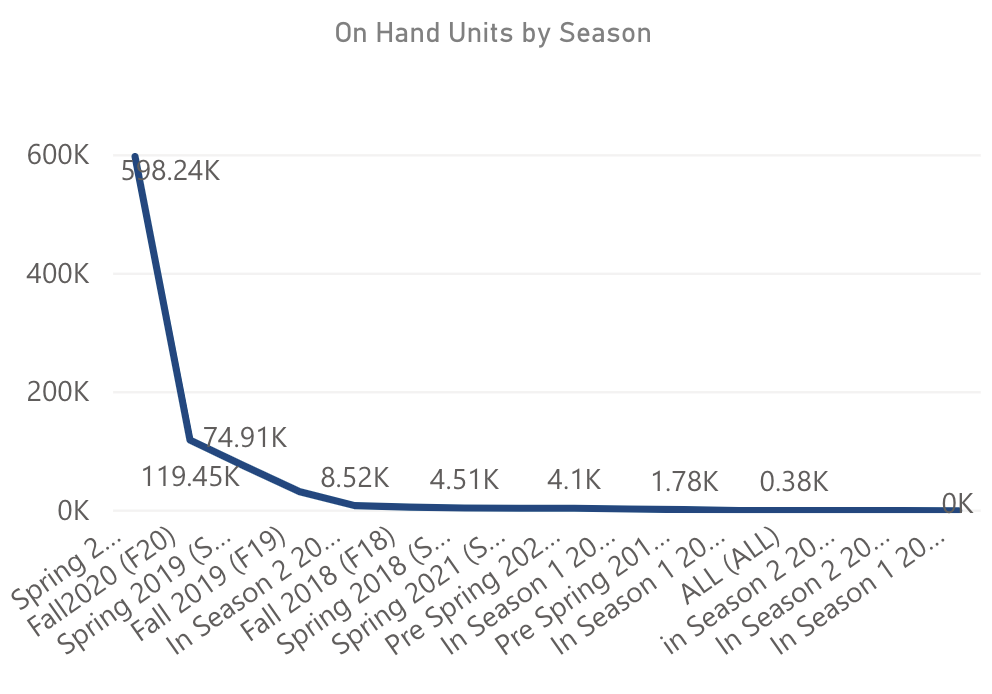
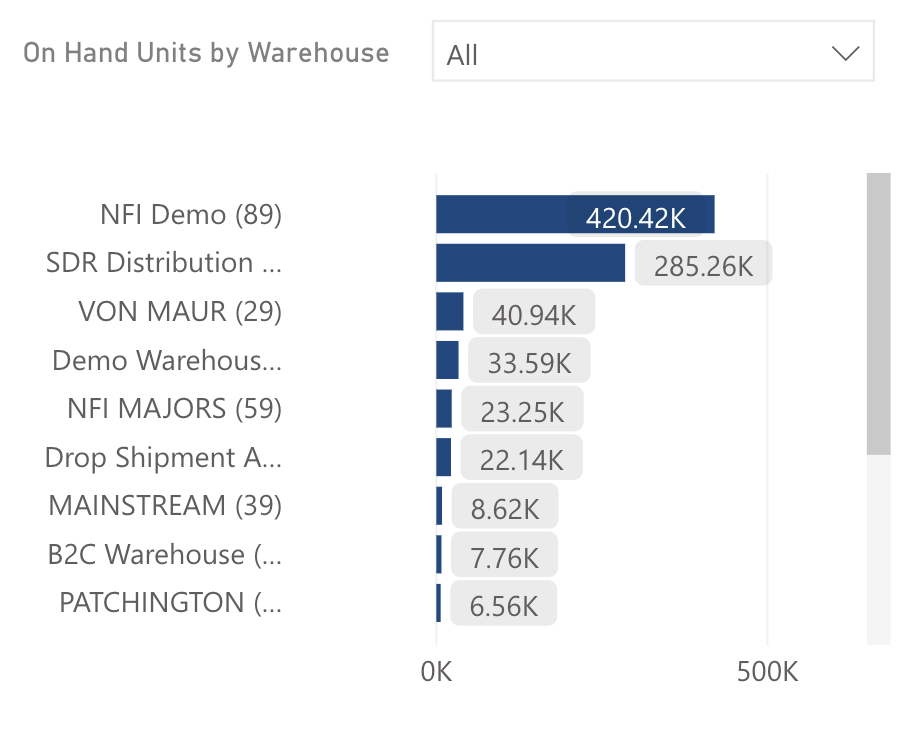
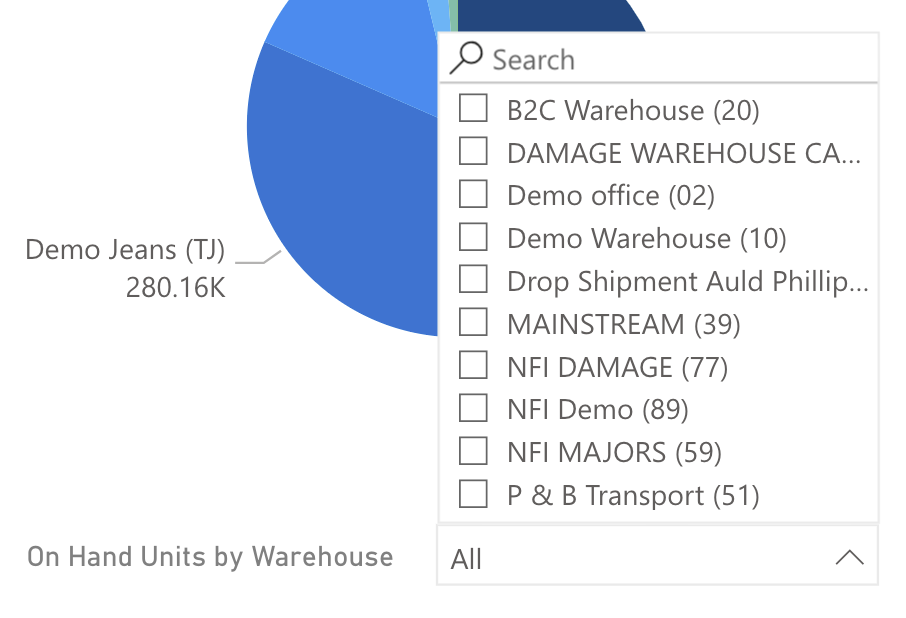

<!-- markdownlint-disable MD033 -->

# Inventory Management

Allows users the ability to analyze Inventory position by inventory category, division, brand, garment type, season, warehouse. All units are shown in thousands (K).

## Slicers

* The Total Company Bar chart specifies which inventory calculation is displayed in the rest of the visuals. Users are able to filter the remaining visuals by the following inventory calculations:
  * Left to Sell = On Hand - Sales Orders + Purchase Orders
  * On Hand = Inventory in the Warehouse(s) – Default selection when user enters the dashboard
  * Available Now = On Hand - Picking - Allocated
  * To Come = Units on Purchase Orders
  * In-Transit = Orders on their way to the warehouse(s)
  * Balance to Ship = Outstanding Units on Sales Orders
  * Allocated = Units on an Allocation

> **Note**: On Hand shows finished goods inventory only

## Selected Inventory Calculation by Division

Displays units by Division for the selected inventory calculation. Selecting part of the chart will focus the visuals on that selected element.

## Selected Inventory Calculation by Brand

Displays units by Brand for the selected inventory calculation. Selecting part of the chart will focus the visuals on that selected element.

## Selected Inventory Calculation by Garment Type

Displays units by Garment Type for the selected inventory calculation. Selecting part of the chart will focus the visuals on that selected element.

## Selected Inventory Calculation by Season

Displays units by Season for the selected inventory calculation. Selecting part of the chart will focus the visuals on that selected element.

## Selected Inventory Calculation by Warehouse

Displays units by Warehouse for the selected inventory calculation. Selecting part of the chart will focus the visuals on that selected element.

Multi-select warehouses using the dropdown menu. Only data for the selected warehouses will be displayed.

