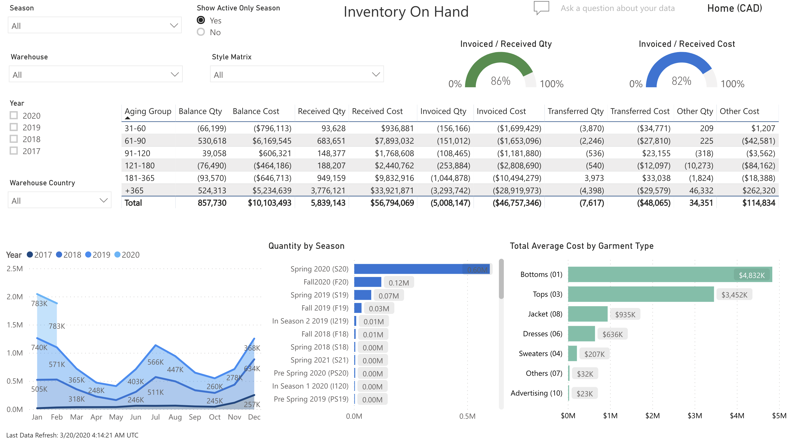
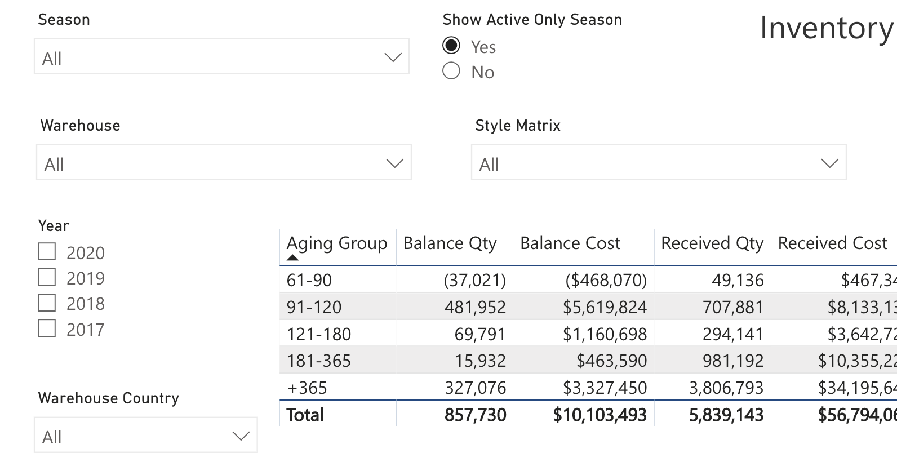
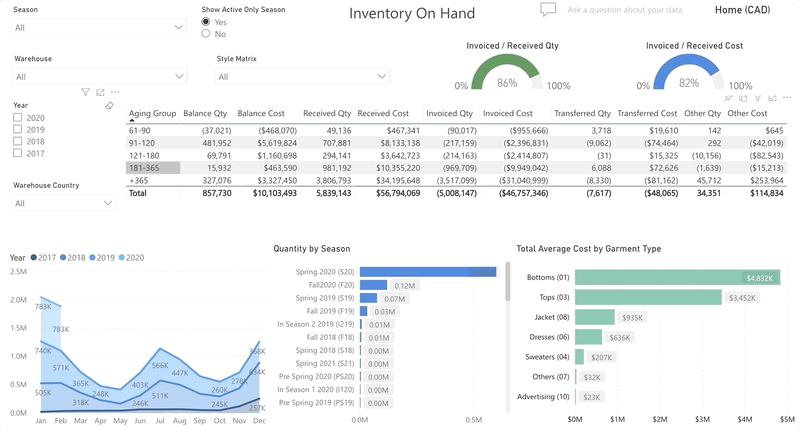
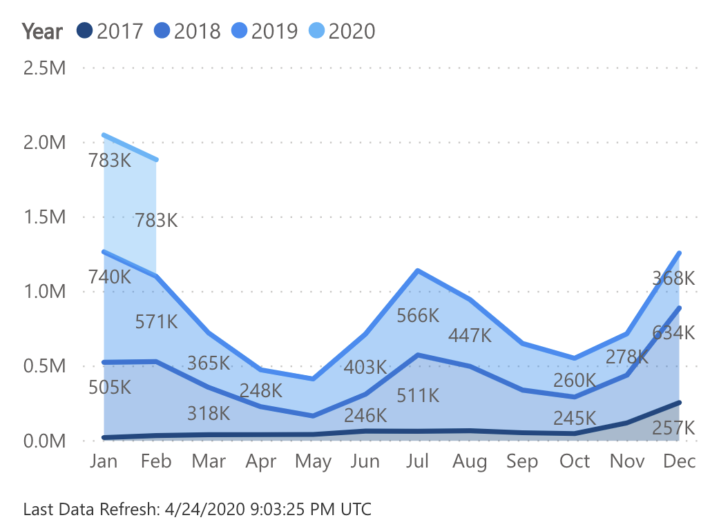
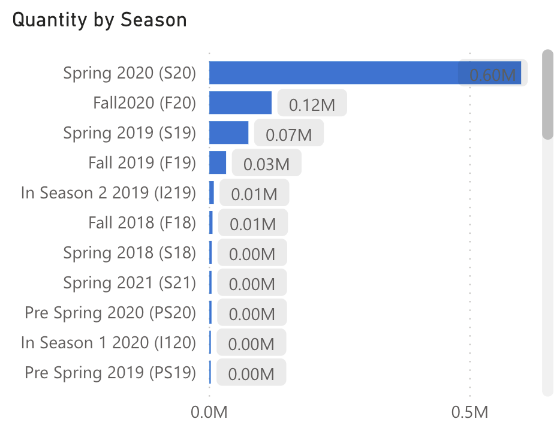
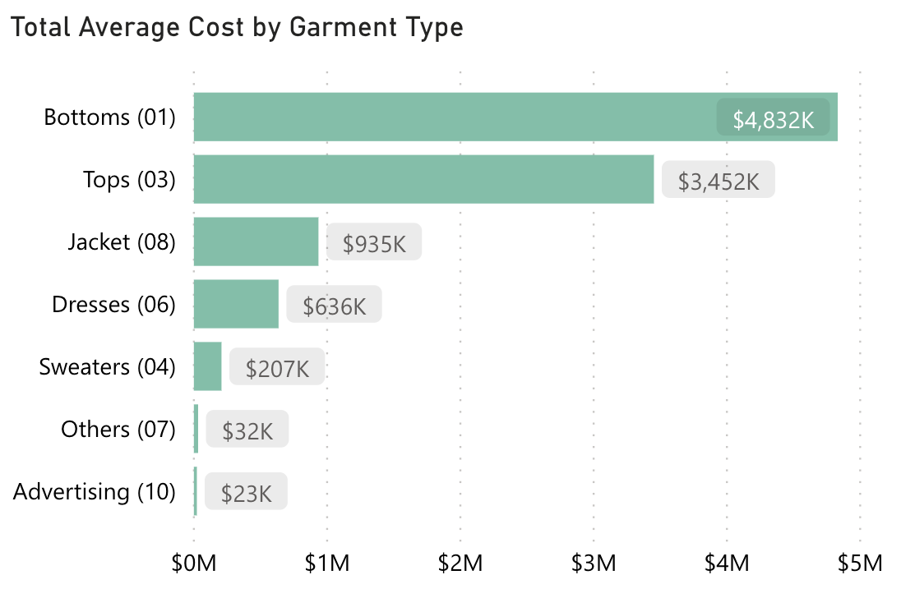

<!-- markdownlint-disable MD033 -->

# Inventory On Hand

Provides users with an inventory aging in the home currency by Warehouse, Style Matrix, Year, and Country.

## Slicers

* Season (Multiple Selection)
  * Will filter the data to only show transactions for the selected seasons
* Active Seasons Only
  * Toggle that determines whether to only show transactions for active seasons
* Warehouse (Multiple Selection)
  * Will filter the data to only show transactions for the selected warehouses
* Style Matrix (Multiple Selection)
  * Will filter the data to only show transactions for the selected styles
* Year (Multiple Selection)
  * Will filter the data to only show transactions for the selected years
* Warehouse Country (Multiple Selection)
  * Will filter the data to only show transactions for warehouses in the selected countries

## Aging

Users can click on any of the headings to modify the sort or on any line to focus the visuals on the selected Aging Group.

## Year

Displays the aging in the form of a graph of dollar amounts in millions by month. Users can click on a specific point to focus the visuals on that month.

## Quantity by Season

Users can view the quantities by Season or click on a specific Season to focus the visuals on it.

## Total Average Cost by Garment Type

Users can view the average cost by Garment Type or click on a specific Garment Type to focus the visuals on it.

