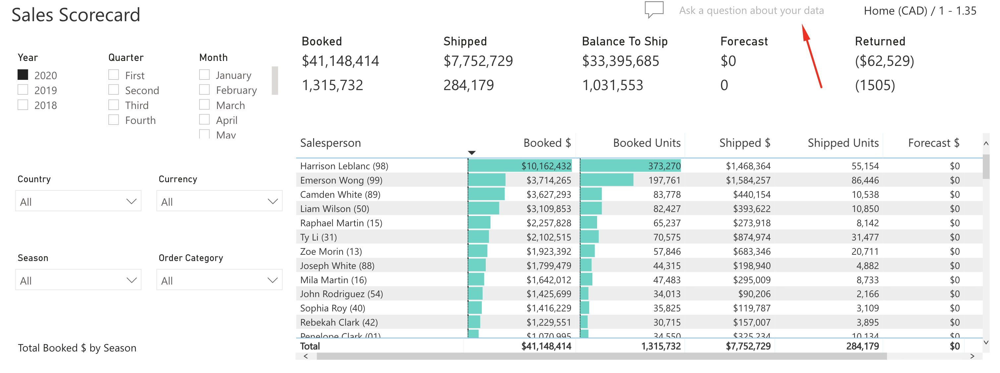
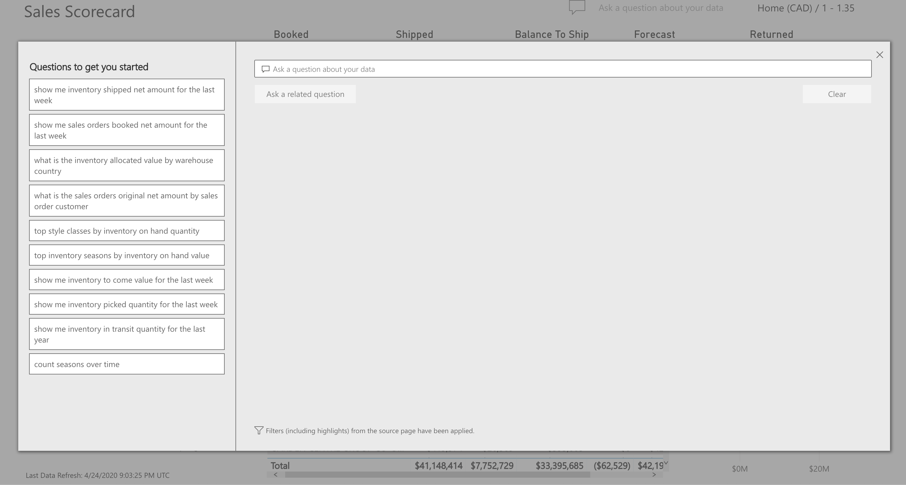

<!-- markdownlint-disable MD033 -->

# BI Q&A

Allows users the ability to ask questions about their data using natural, English language queries. Power BI will provide answers to a user’s questions in the form of visuals such as charts and graphs. BI Q&A is available on all Momentis BI dashboards.

Within any Momentis BI dashboard, click on "Ask a question about your data",

the following pop-up will appear,

Users can select a question from the left-hand panel or alternatively, enter a question in the top field and Power BI will answer the question using charts and graphs.

