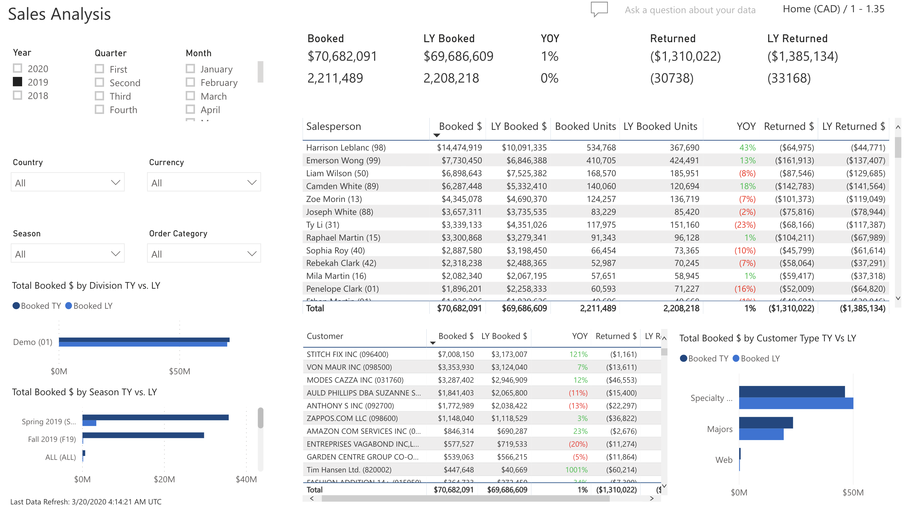

# Sales Analysis

Allows users the ability to analyze sales this year compared to last year by Salesperson, Customer, Division, Season and Customer Type.

## Slicers

The slicers consist of the following:

* Period (Multiple Selection): Year, Quarter, Month
  * Will filter the data to only show the period(s) selected
* Country (Multiple Selection)
  * Will filter the data to only show transactions for the selected country
* Currency (Multiple Selection)
  * If selected, will filter the data to show only the transactions for that currency
* Season (Multiple Selection)
  * Will filter the data to only show the data related to the seasons selected
* Order Category (Multiple Selection)
  * Will filter the data to only show the data related to the order categories selected

> **Note**: If nothing is selected, the data on the screen will be converted to the Home Currency of the ERP.

## Totals

* Booked
  * Dollars = Shipped Dollars + Balance to Ship Dollars
  * Units = Shipped Units + Balance to Ship Units
* LY Booked
  * Dollars = Shipped Dollars + Balance to Ship Dollars for the same period last year
  * Units = Shipped Units + Balance to Ship Units for the same period last year
* YOY = [(This Year – Last Year) / Last Year] * 100
* Returned
  * Dollars = Sum of all Invoice Dollars where AR Type = 02 (Credit Note)
  * Units = Sum of all Invoice Units where AR Type = 02 (Credit Note)
* LY Returned 
  * Dollars = Sum of all Invoice Dollars where AR Type = 02 (Credit Note) for the same period last year
  * Units = Sum of all Invoice Units where AR Type = 02 (Credit Note) for the same period last year
  * Returns is the net total of Credit Notes

> **Note**: Calendar dates are used, not fiscal

## Currency Label

Indicates whether the data shown is in Home or Local Currency, along with the exchange rate stored in the system.

## Salesperson

The salesperson section consists of the following:

* Salesperson
* Booked $ = Shipped Dollars + Balance to Ship Dollars
* LY Booked $ = Shipped Dollars + Balance to Ship Dollars for the same period last year
* YOY = [(This Year – Last Year) / Last Year] * 100
* Returned $ = Dollars = Sum of all Invoice Dollars where AR Type = 02 (Credit Note)
* LY Returned $ = Sum of all Invoice Dollars where AR Type = 02 (Credit Note) for the same period last year

> **Note**: Calendar dates are used, not fiscal

## Customer

The customer section consists of the following:

* Customer
* Booked $ = Shipped Dollars + Balance to Ship Dollars
* LY Booked $ = Shipped Dollars + Balance to Ship Dollars for the same period last year
* YOY = [(This Year – Last Year) / Last Year] * 100
* Returned $ = Dollars = Sum of all Invoice Dollars where AR Type = 02 (Credit Note)
* LY Returned $ = Sum of all Invoice Dollars where AR Type = 02 (Credit Note) for the same period last year

> **Note**: Calendar dates are used, not fiscal

## Total Booked $ by Division TY vs. LY

Allows users the ability to hover to see the Total Booked $ by Division this year or select a Division to focus the dashboard on only the numbers for that Division.

> **Note**: Calendar dates are used, not fiscal

## Total Booked $ by Season TY vs. LY

Allows users the ability to hover to see the Total Booked $ by Season this year or select a Season to focus the dashboard on only the numbers for that Season.

> **Note**: Calendar dates are used, not fiscal

## Total Booked $ by Customer Type TY vs. LY

Allows users the ability to hover to see the Total Booked $ by Customer Type this year or select a Customer Type to focus the dashboard on only the numbers for that Customer Type.

> **Note**: Calendar dates are used, not fiscal

> **Note**: All dollar amounts are net, not gross
