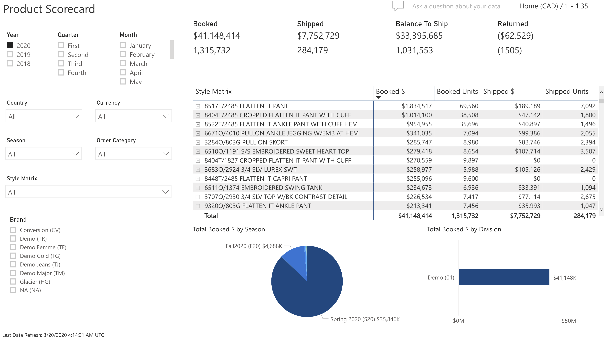
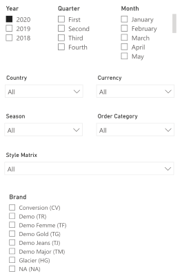
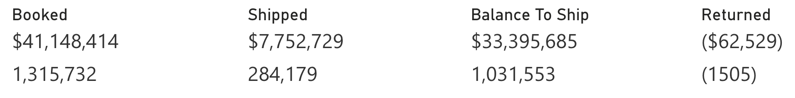
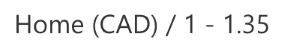
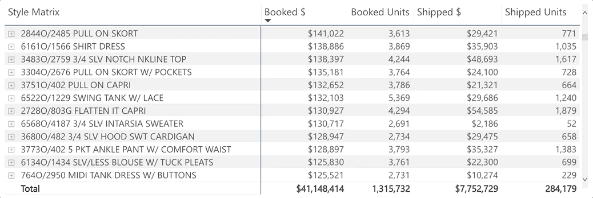
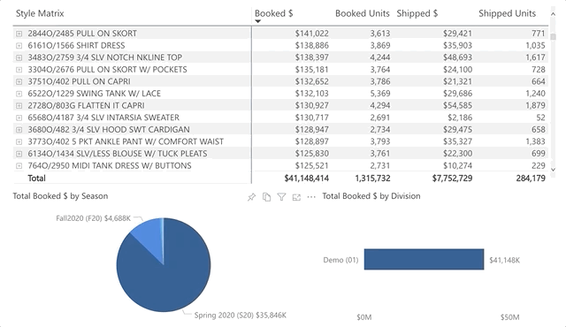
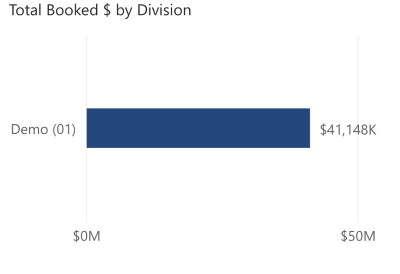

# Product Scorecard

The Product Scorecard allows users the ability to analyze product sales data across periods at the style-color level, by Brand, by Season and by Division.

## Slicers

Allow users to filter the data within the screen.

* Period (Multiple Selection): Year, Quarter, Month
  * Will filter the data to only show the period(s) selected
* Country (Multiple Selection)
  * Will filter the data to only show transactions for the selected countries
* Currency (Multiple Selections)
  * If selected, will filter the data to show only the transactions for the selected currencies
* Season (Multiple Selections)
  * Will filter the data to only show the data related to the seasons selected
* Brand (Multiple Selections)
  * Will filter the data to only show the transactions related to the selected brands

> **Note**: If nothing is selected, the data on the screen will be converted to the Home Currency of the ERP.

## Totals

Shows the Total Dollars and Units.

* Booked
  * Dollars = Shipped Dollars + Balance to Ship Dollars
  * Units = Shipped Units + Balance to Ship Units
  * Balance To Ship is based on the order creation date
* Shipped
  * Dollars = Sum of Shipped Dollars on Invoices where AR Type Code = 01 (Invoices)
  * Units = Sum of Shipped Units on Invoices where AR Type Code = 01 (Invoices)
* Balance to Ship
  * Dollars = Order Dollars – Shipped Dollars
  * Units = Order Units – Shipped Units
  * Balance To Ship is based on the order creation date
* Returned 
  * Dollars = Sum of all Invoice Dollars where AR Type = 02 (Credit Note)
  * Units = Sum of all Invoice Units where AR Type = 02 (Credit Note)

> **Note**: GL transaction are not included in the Return calculation.

## Currency Label

Indicates whether the data shown is in Home or Local Currency, along with the exchange rate stored in the system.

## Style Grid

Detailed information down to the style color level.

The Style grid consists of the following information:

* Style Identifiers
* Description: Style Description
* Color: Style Color Description
* Booked $ = Shipped Dollars + Balance to Ship Dollars
* Booked Units = Shipped Units + Balance to Ship Units
* Shipped $ = Sum of Shipped Dollars on Invoices where AR Type Code = 01 (Invoices)
* Shipped Units = Sum of Shipped Units on Invoices where AR Type Code = 01 (Invoices)

## Total Booked $ by Season

Allows users to hover to see the Total Booked $ by Season or, select a season to focus the dashboard on only the numbers for that season.

## Total Booked $ by Division

Allows users to hover to see the Total Booked $ by Division, or select a Division to focus the dashboard on only the numbers for that Division.

> **Note**: All dollar amounts are net, not gross.
