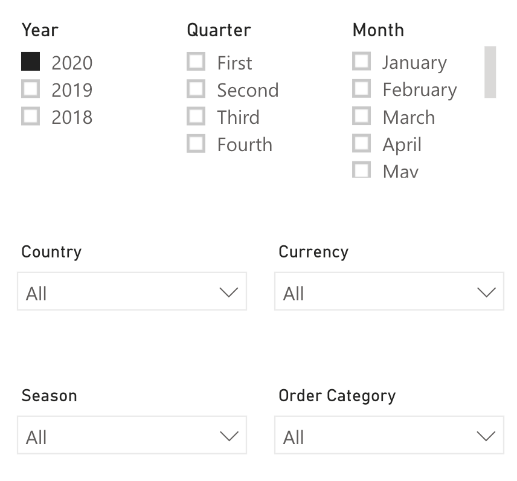
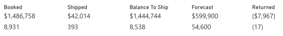
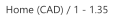
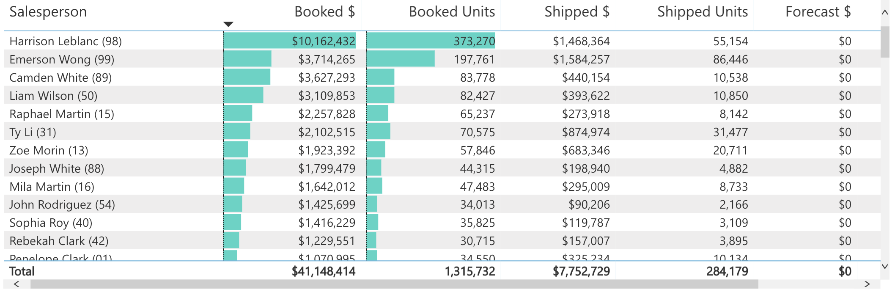
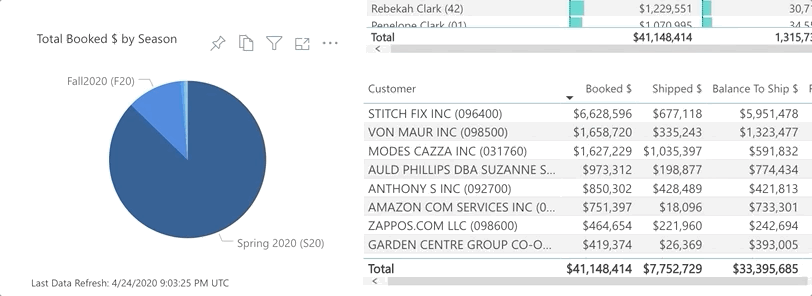
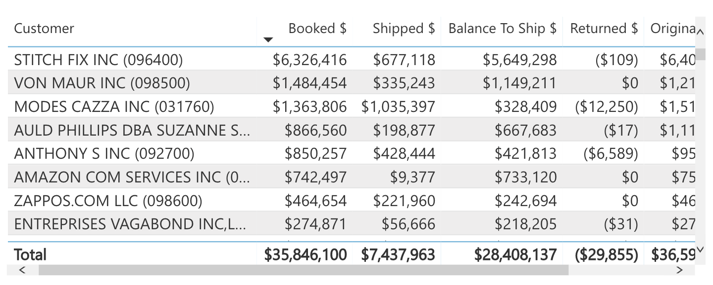
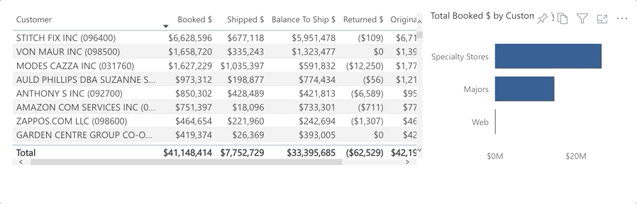

# Sales Scorecard

The Sales Scorecard allows users the ability to analyze sales and sales forecast data across periods by Salesperson, Customer Type, Customer, and Season.

The Sales Scorecard can be broken down into the following sections:

## Slicers

* The slicers on the Sales Scorecard consist of the following:
  * Period (Multiple Selection): Year, Quarter, Month
    * Will filter the data to only show the period(s) selected
  * Country (Single Selection)
    * Will filter the data to only show transactions for the selected country
  * Currency (Single Selection)
    * If selected, will filter the data to show only the transactions for that currency
  * Season (Multiple Selection)
    * If selected, will filter the data to only show transactions related to those Seasons
  * Order Category (Multiple Selection)
     If selected, will filter the data to only show transactions related to those Order Categories

> **Note**: If nothing is selected, the data on the screen will be converted to the Home Currency of the ERP.

## Totals

* The totals sections on the Sales Scorecard consists of the following:

  * Booked
    * Dollars = Shipped Dollars + Balance to Ship Dollars
    * Units = Shipped Units + Balance to Ship Units
  * Shipped
    * Dollars = Sum of Shipped Dollars on Invoices where AR Type Code = 01 (Invoices)
    * Units = Sum of Shipped Units on Invoices where AR Type Code = 01 (Invoices)
  * Balance to Ship
    * Dollars = Sales Orders Dollars – Shipped Dollars
    * Units = Sales Orders Units – Shipped Units
  * Forecast
    * Dollars = The Forecast Dollars manually entered or uploaded to the Sales Forecast screen in the Fashion Web App
    * Units = The Forecast Units manually entered or uploaded to the Sales Forecast screen in the Fashion Web App
  * Returned
    * Dollars = Sum of all Invoice Dollars where AR Type = 02 (Credit Note)
    * Units = Sum of all Invoice Units where AR Type = 02 (Credit Note)
    * Returns is the net total of Credit Notes

> **Note**: General Ledger transactions are not included in the Return calculation.

## Currency Label

Indicates whether the data shown is in Home or Local Currency along with the exchange rate stored in the ERP.

## Salesperson Grid

The Salesperson grid consists of the following:

* Salesperson
* Booked $ = Shipped Dollars + Balance to Ship Dollars
* Booked Units = Shipped Units + Balance to Ship Units
* Shipped $ = Sum of Shipped Dollars on Invoices where AR Type Code = 01 (Invoices)
* Shipped Units = Sum of Shipped Units on Invoices where AR Type Code = 01 (Invoices)
* Forecast $ = The Forecast Dollars manually entered or uploaded to the Sales Forecast screen in Fashion Web App

## Total Booked $ by Season

Allows users to hover to see the Total Booked $ by Season or select a season to focus the dashboard on only the numbers for that season.

## Customer Grid

The Customer Grid consists of the following:

* Customer
* Booked $ = Shipped Dollars + Balance to Ship Dollars
* Shipped $ = Sum of Shipped Dollars on Invoices where AR Type Code = 01 (Invoices)
* Balance to Ship $ = Order Dollars – Shipped Dollars
* Return $ = Sum of all Invoice Dollars where AR Type = 02 (Credit Note)
* Forecast $ = The Forecast Dollars manually entered or uploaded to the Sales Forecast screen in Fashion Web App

## Total Booked $ by Customer Type

Allows users the ability to hover to see the Total Booked $ by Customer Type or select a Customer Type to focus the dashboard on only the numbers for that Customer Type.

> **Note**: All dollar amounts are net, not gross.
