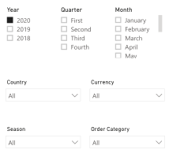

# Sales Scorecard

The Sales Scorecard allows users the ability to analyze sales and sales forecast data across periods by Salesperson, Customer Type, Customer, and Season.

The Sales Scorecard can be broken down into the following sections:

## Slicers

* The slicers on the Sales Scorecard consist of the following: 
  * Period (Multiple Selection): Year, Quarter, Month
    * Will filter the data to only show the period(s) selected
  * Country (Single Selection)
    * Will filter the data to only show transactions for the selected country
  * Currency (Single Selection)
    * If selected, will filter the data to show only the transactions for that currency
  * Season (Multiple Selection)
    * If selected, will filter the data to only show transactions related to those Seasons
  * Order Category (Multiple Selection)
     If selected, will filter the data to only show transactions related to those Order Categories

> **Note**: If nothing is selected, the data on the screen will be converted to the Home Currency of the ERP.
