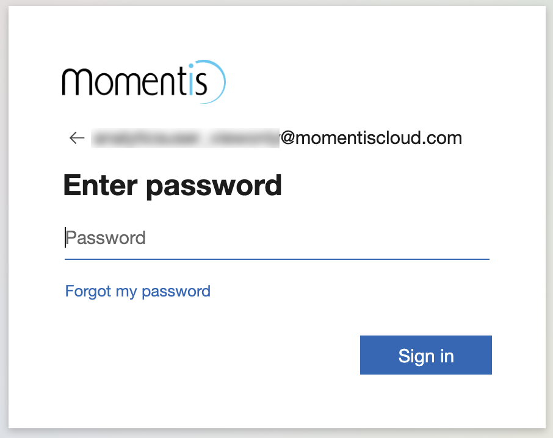
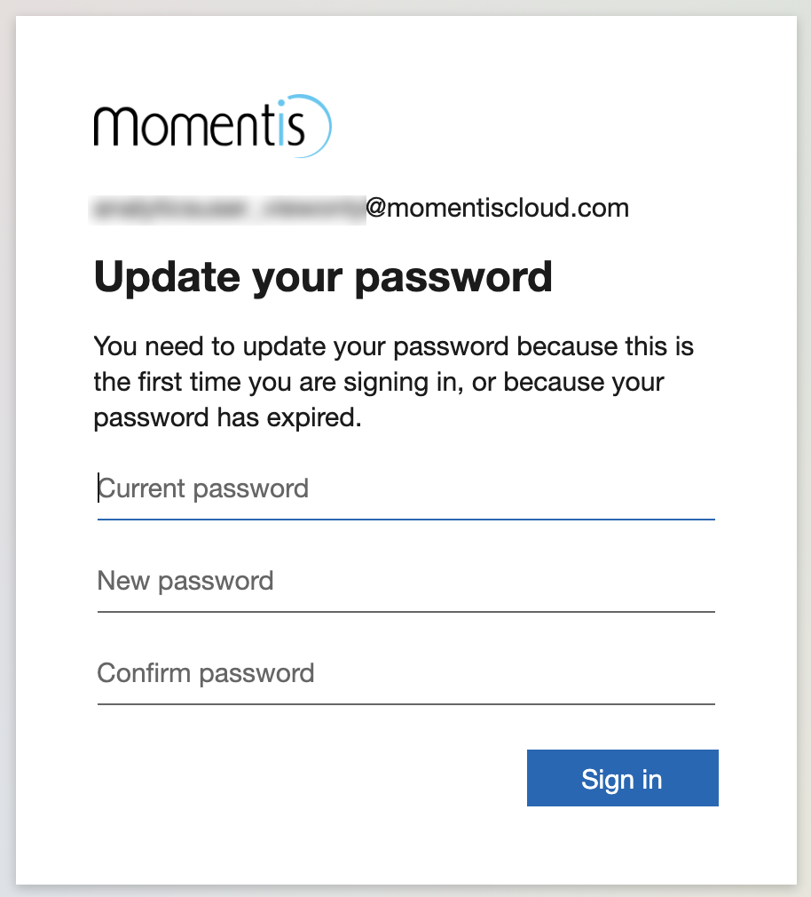
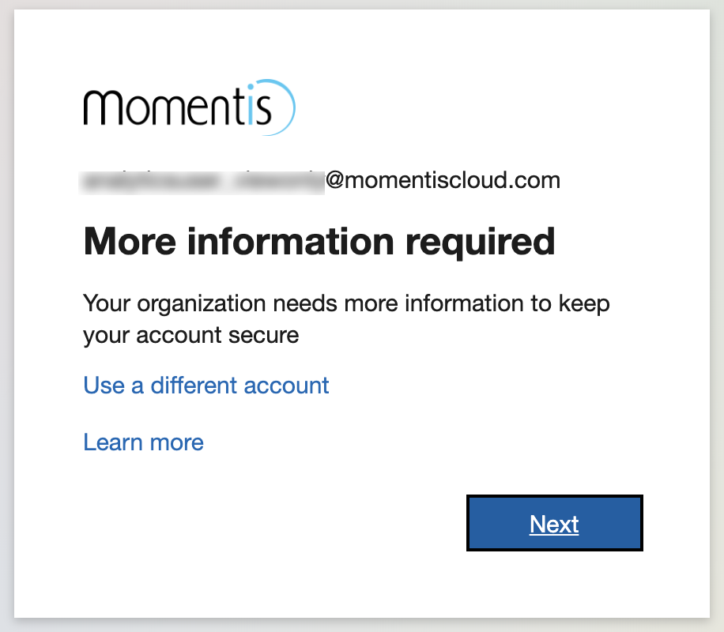
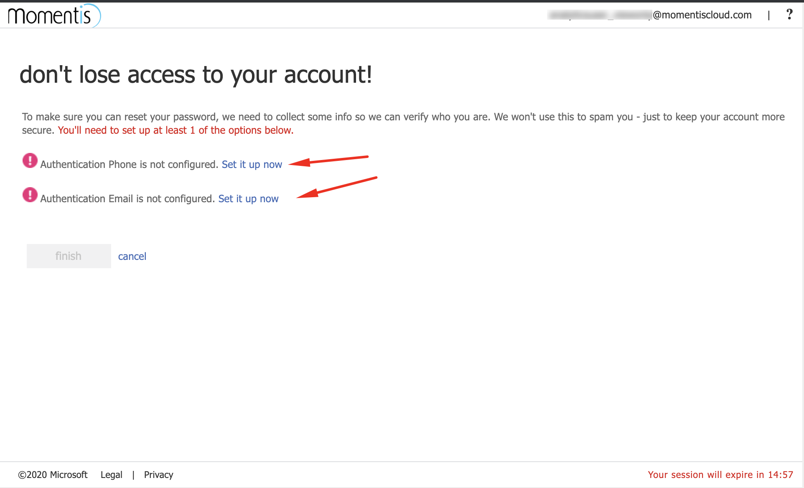

<!-- markdownlint-disable MD033 -->

# Security

## Login

To use trenza.bi, you will need to login with a momentis.com or momentiscloud.com account.

### First time login with temporary password

If are logging in for the first time with a new momentiscloud.com account, you will need to change your password at first login.

Enter the temporary password that you have been provided.

You will be prompted to change your password by re-entering your temporary password and entering a new password of your choosing.

You might then be prompted to enter additional information. Click "Next".

You can optionally enter a phone number and alternate email address in case you need to reset your password in the future. If you prefer to not enter either piece of information, click "Cancel".

