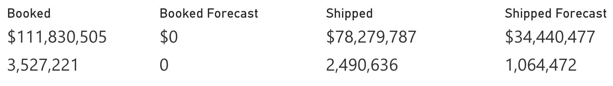
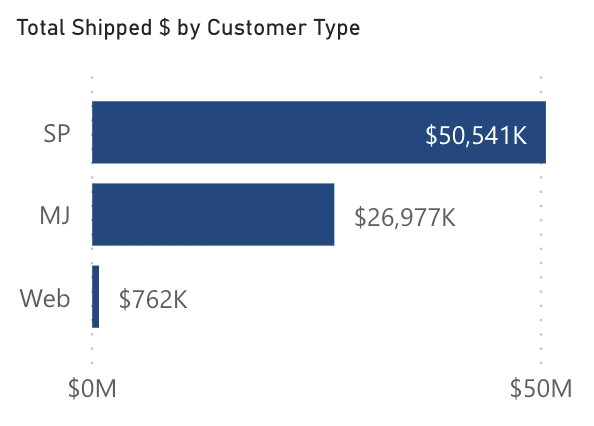

<!-- markdownlint-disable MD033 -->

# Shipping Projection

Allows users the ability to analyze how actual shipping is trending against forecasted shipping for a given time.

## Slicers

* Date
  * Allows users the ability to select a date range
* Country (Multiple Selection)
  * Will filter the data to only show transactions for the selected countries
* Currency (Multiple Selection)
  * If selected, will filter the data to show only the transactions for the selected currency

## Totals

* Booked
  * Dollars = Shipped Dollars + Balance to Ship Dollars
  * Units = Shipped Units + Balance to Ship Units
* Booked Forecast
  * Dollars = The Forecast Dollars manually entered or uploaded to the Sales Forecast screen in Fashion Web App
  * Units = The Forecast Units manually entered or uploaded to the Sales Forecast screen in Fashion Web App
* Shipped
  * Dollars = Sum of Shipped Dollars on Invoices where AR Type Code = 01 (Invoices)
  * Units = Sum of Shipped Units on Invoices where AR Type Code = 01 (Invoices)
* Shipped Forecast
  * Dollars = Open Orders (Including BTS) $ + Shipped $
  * Units = Open Orders (Including BTS) Units + Shipped Units

## Currency

Indicates whether the data shown is in Home or Local Currency, along with the exchange rate stored in the system.

## Forecast vs. Actual Booking

Analyze the Booked Dollars and Units against Forecast Dollars and Units by month. Hovering over a bar will show the Actual Dollars, Actual Units, Forecast Dollars, Forecast Units for the month. Selecting a bar will focus the data to that month.

## Forecast vs. Actual Shipping

Analyze the Shipping Dollars and Units against Forecast Dollars and Units by month. Hovering over a bar will show the Actual Dollars, Actual Units, Forecast Dollars, Forecast Units for the month. Selecting a bar will focus the data to that month.

## Total Shipped $ by Customer Type

Hovering over a bar will show the Actual $, Forecast $ and % to Forecast for that Customer Type.

## Total Shipped $ by Season

Hovering over a bar will the Actual $, Forecast $ and % to Forecast for that Season.

> **Notes**:
>
> * The forecast date is based on the start delivery date.
> * All dollar amounts are net, not gross.
